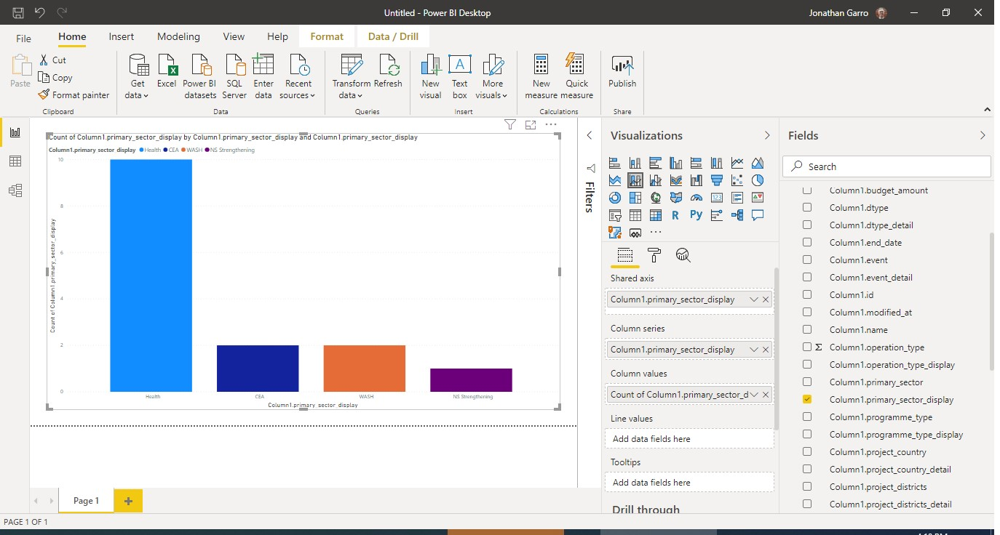

### Building Your Query

The API can be accessed by building a URL query. We start with the base URL to
access the database, then set parameters to select just the data that we need.
In this example, we need to access _Projects_ and then set the _Country_
parameter to Nepal. Note that to select countries, you’ll need to use the
associated ISO code (specifically,
[the Alpha-3 code](https://www.iso.org/obp/ui/#search/code/)).

So our URL for this particular search would look like this:

https://goadmin.ifrc.org/api/v2/project/?country=NPL

### Get Your Data Into PowerBI

1. Open PowerBI and select “Get Data” from the top ribbon, then select “Web”.
2. Type your URL into the window that appears and click OK.
3. This will open a new window called Power Query Editor where you can organize
   the data that is returned in preparation for visualization.
4. First give your query a name. When you start bringing in lots of different
   queries, it can be hard to remember what each one is doing. So on the left
   pane with the query selected, look at the right side of the window and rename
   it to something like “Nepal Projects”.
5. The data comes into PowerBI in JSON format, which makes transferring the data
   easy, but can be difficult to easily interpret. Our Nepal Projects query
   returned 15 lines (note that if you’re following along this number might
   change based on activity within GO), but we can’t see much about those
   projects. Click on the “List” link next to results. Now each result from GO
   is listed as a distinct record.
6. Having a list with “Record” doesn’t tell us much. Converting it to a table
   will make it easier to read, so click the “Convert to Table” in the
   “Transform” section of the ribbon at the top of the window. In the window
   that pops up, select “None” and “Show as errors” for the two options.
7. Right now, our table has an index column (numbering the rows) and “Column1”,
   which is just a placeholder for the data for that particular result. Use the
   button at the top right of the table and you’ll see all the columns that
   we’ve pulled from GO. These should all be selected by default. Click OK. Now
   we’re able to see what data this query is actually providing us! We’re ready
   to start building our visuals, so click Close and Apply at the top of your
   Power Query Editor window.

### Set Up Your Visualization

The three icons to the far left of your screen include, in descending order:

-   Report: A preview and editor pane for your dashboard. This is where we’ll
    build the actual visualization.
-   Data: A way to more easily view the data that you have connected. In this
    example, you’ll see the Nepal Projects data we pulled into PowerBI in the
    previous section of this walkthrough. As you get more comfortable with
    PowerBI, you might bring in additional data sources.
-   Model: This allows you to view your various data sources and create
    relationships between fields. In this simple example, we won’t be using this
    tab, but in cases where you have multiple data sources, this is an important
    tab.

1. Start by selecting the Report tab. Along the right side of your window, you
   should see three sections: Filters, Visualizations, and Fields. (These may be
   collapsed. If so, use the arrow to expand them). For this example, we’re
   going to be working with bar charts to visualize the relative proportion of
   projects by sector, so select either the vertical or horizontal bar chart.
   We’re only working with a single column of data, so a stacked bar chart will
   work for our purposes.
2. After clicking on the chart type, a blank placeholder should appear in the
   preview pane. To populate the chart with your data, we need to drag the
   relevant fields from the far right pane into the fields below the
   visualizations. In this simple example, we only need to worry about the
   column that has the sector data. GO has several fields that contain the word
   “sector”, so we might want to refresh our memory and make sure we’re using
   the right column from the data source. Pop over into the Data tab and scroll
   to the right to find the right one. It looks like “primary_sector_display” is
   the right one. Go back to the Report tab.
3. From the fields pane on the far right, find “primary_sector_display”, and
   drag it over into the Axis field. Then repeat for the Legend and Values
   fields. For the Values field, PowerBI is smart enough to understand what
   we’re doing, so it counts the frequency each unique value appears in that
   list and generates that bar chart!

